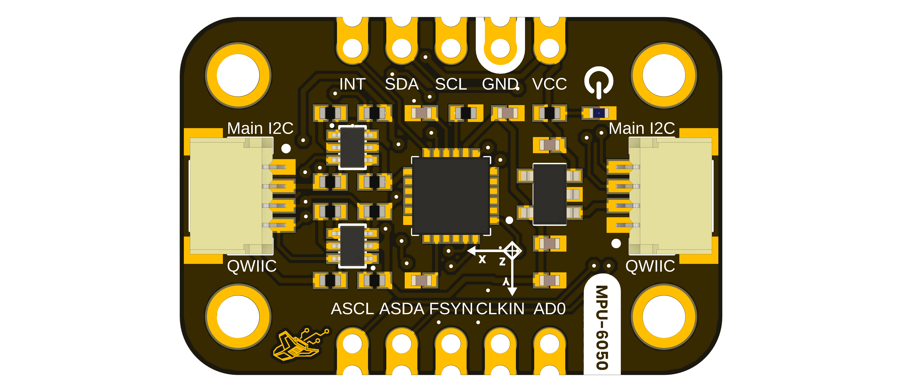

# DevLab: I2C MPU-6050 6-Axis IMU Module

The DevLab I2C MPU-6050 6-Axis IMU Module combines a three-axis accelerometer
and a three-axis gyroscope. The board exposes the main I2C bus, the MPU-6050
auxiliary I2C bus, interrupt and synchronization signals, an onboard 3.3 V
regulator, and level shifting on both I2C buses.

  
  
<em>DevLab I2C MPU-6050 6-Axis IMU Module</em>

### Quick Setup

## Overview

| Feature | Description |
|---|---|
| Inertial sensor | MPU-6050 (`IC1`) |
| Motion sensing | Three-axis accelerometer and three-axis gyroscope |
| Sensor full-scale ranges | Accelerometer: ±2 g, ±4 g, ±8 g, ±16 g; gyroscope: ±250, ±500, ±1000, ±2000 dps |
| Sensor conversion | Six 16-bit ADCs, one per accelerometer and gyroscope axis |
| Host interface | I2C through `SCL` and `SDA` |
| Auxiliary interface | MPU-6050 auxiliary I2C through `ASCL` and `ASDA` |
| Additional signals | `INT`, `AD0`, `FSYNC`, and `CLKIN` |
| Regulation | AP2112K-3.3 (`U2`), 3.3 V regulator output |
| I2C level shifting | Two BSS138AKDW dual N-channel MOSFET arrays (`Q1`, `Q2`) |
| Connectors | Four 4-position JST SR-series connectors and two 1x5, 2.54 mm headers |
| Hardware revision | V1.0 |
| Manufacturer part number | UE0129 |

Module-level input voltage, logic thresholds, current consumption, clock
limits, and mechanical dimensions are pending validation.

## Applications

- Evaluation of acceleration and angular-rate sensing
- Motion-sensing prototypes
- I2C sensor integration and educational experiments
- Experiments using the MPU-6050 auxiliary sensor bus and synchronization pins

## Resources

- [Schematic Diagram](https://github.com/UNIT-Electronics-MX/unit_devlab_i2c_mpu6050_6_axis_imu/blob/main/hardware/unit_sch_v_1_0_0_ue129_mpu6050_imu.pdf)
- [Datasheet](https://github.com/UNIT-Electronics-MX/unit_devlab_i2c_mpu6050_6_axis_imu/blob/main/hardware/resources/external/mpu-6050_datasheet_v3%204.pdf)
- **Pinout Diagram:** pending publication; see the verified pin tables in the [hardware documentation](https://github.com/UNIT-Electronics-MX/unit_devlab_i2c_mpu6050_6_axis_imu/blob/main/hardware/README.md).
- [Getting Started Guide](https://github.com/UNIT-Electronics-MX/unit_devlab_i2c_mpu6050_6_axis_imu/blob/main/software/README.md) — experimental; hardware validation is pending.

## 📝 License

All hardware and documentation in this project are licensed under the **MIT License**.  
See the [LICENSE](https://github.com/UNIT-Electronics-MX/unit_devlab_i2c_mpu6050_6_axis_imu/blob/main/LICENSE) for details.

  Template created by UNIT Electronics

> **Note of Development:**
> This hardware module is under active development. File and directory structures, naming conventions, and documentation formats may change as the design evolves.
